# Triton Custom Kernels & Mathematical Derivatives

This directory contains high-performance, fused GPU kernels implemented in [Triton](https://triton-lang.org/) for LLM training and inference, alongside rigorous mathematical derivations of their forward and backward passes.

---

## Table of Contents
1. [Overview & Kernel Architecture](#overview--kernel-architecture)
2. [Kernel 1: Fused Add RMSNorm](#1-fused-add-rmsnorm)
   - [Forward Formulation](#11-forward-formulation)
   - [Backward Pass Derivation](#12-backward-pass-derivation)
   - [Triton Implementation Mapping](#13-triton-implementation-mapping)
   - [Handwritten Notes Reference](#14-handwritten-notes-reference)
3. [Kernel 2: SwiGLU with Soft Clamping](#2-swiglu-with-soft-clamping)
   - [Forward Formulation](#21-forward-formulation)
   - [Backward Pass Derivation](#22-backward-pass-derivation)
   - [Triton Implementation Mapping](#23-triton-implementation-mapping)
   - [Handwritten Notes Reference](#24-handwritten-notes-reference)
4. [Kernel 3: Rotary Position Embedding (RoPE)](#3-rotary-position-embedding-rope)
   - [Forward Formulation](#31-forward-formulation)
   - [Backward Pass Derivation](#32-backward-pass-derivation)
   - [Triton Implementation Mapping](#33-triton-implementation-mapping)
   - [Handwritten Notes Reference](#34-handwritten-notes-reference)
5. [Kernel 4: Fused Linear Cross Entropy](#4-fused-linear-cross-entropy)
   - [Forward Formulation](#41-forward-formulation)
   - [Backward Pass Derivation](#42-backward-pass-derivation)
   - [Triton Implementation Mapping](#43-triton-implementation-mapping)
   - [Handwritten Notes Reference](#44-handwritten-notes-reference)
6. [Benchmarking & Verification](#benchmarking--verification)

---

## Overview & Kernel Architecture

Standard PyTorch implementations often suffer from kernel launch overhead and unnecessary round-trips to high-bandwidth memory (HBM) for intermediate activations. The custom Triton kernels in this repository fuse memory-bound operations (element-wise additions, normalization, activations, rotations, and cross-entropy projections) directly in GPU SRAM.

| Kernel | Source File | PyTorch Autograd Function | Key Optimizations |
| :--- | :--- | :--- | :--- |
| **Fused Add RMSNorm** | [`fused_add_rms_norm.py`](./fused_add_rms_norm.py) | `FusedAddRMSNormFunction` | Single-pass residual addition + normalization, persistent weight gradient accumulation |
| **SwiGLU** | [`swiglu.py`](./swiglu.py) | `TritonSwigluFunction` | Fused SiLU gating + linear up-projection + tanh soft-capping |
| **RoPE** | [`apply_rope.py`](./apply_rope.py) | `TritonRoPEFunction` | Fused 2D rotary embedding in SRAM across sequence and batch dimensions |
| **Fused Linear Cross Entropy** | [`fused_linear_cross_entropy.py`](./fused_linear_cross_entropy.py) | `FusedLinearCrossEntropyFunction` | Online log-sum-exp (LSE), chunked logit generation without full HBM materialization |

---

## 1. Fused Add RMSNorm

- **Implementation**: [`fused_add_rms_norm.py`](./fused_add_rms_norm.py)
- **Handwritten Notes**: [Page 1](../../assets/kernel_derivatives_notes/IMG_6121.png) | [Page 2](../../assets/kernel_derivatives_notes/IMG_6122.png) | [Page 3](../../assets/kernel_derivatives_notes/IMG_6123.png)

### 1.1 Forward Formulation

Given an input activation vector from the previous sublayer $X \in \mathbb{R}^N$ and a residual input $R \in \mathbb{R}^N$:

1. **Residual Summation**:
   $$S = X + R$$

2. **Root Mean Square Normalization**:
   $$\text{RMS}(S) = \frac{S}{\sqrt{\frac{1}{N}\sum_{k=1}^N S_k^2 + \varepsilon}} = S \cdot \sigma^{-1}$$
   where we define the reciprocal standard deviation (rstd) as:
   $$\sigma^{-1} = \left(\frac{1}{N}\sum_{k=1}^N S_k^2 + \varepsilon\right)^{-\frac{1}{2}}$$

3. **Normalized & Scaled Output**:
   $$\hat{X} = \text{RMS}(S) = S \cdot \sigma^{-1}$$
   $$Y = W \odot \hat{X}$$
   where $W \in \mathbb{R}^N$ is the learnable gain parameter and $\odot$ denotes element-wise (Hadamard) multiplication.

---

### 1.2 Backward Pass Derivation

Let $L$ denote the scalar loss function. The upstream gradient is $\nabla_Y = \frac{\partial L}{\partial Y} = dY$.

#### Step 1: Weight Gradient ($\frac{\partial L}{\partial W}$)
$$\frac{\partial L}{\partial W} = \frac{\partial L}{\partial Y} \odot \frac{\partial Y}{\partial W} = \nabla_Y \odot \hat{X}$$
Accumulated across all batch and sequence dimensions $M$:
$$dW = \sum_{m=1}^M (dY_m \odot \hat{X}_m)$$

#### Step 2: Gradient w.r.t. Normalized Activations ($\frac{\partial L}{\partial \hat{X}}$)
$$\frac{\partial L}{\partial \hat{X}} = \frac{\partial L}{\partial Y} \odot \frac{\partial Y}{\partial \hat{X}} = \nabla_Y \odot W = d\hat{X}$$

#### Step 3: Gradient w.r.t. Summed State $S$ ($\frac{\partial L}{\partial S}$)
Using the multivariable chain rule:
$$\frac{\partial L}{\partial S_i} = \sum_{j=1}^N \frac{\partial L}{\partial \hat{X}_j} \frac{\partial \hat{X}_j}{\partial S_i} = \sum_{j=1}^N d\hat{X}_j \frac{\partial}{\partial S_i}\left( S_j \sigma^{-1} \right)$$

Evaluating the Jacobian $\frac{\partial \hat{X}_j}{\partial S_i}$:
$$\frac{\partial \hat{X}_j}{\partial S_i} = \frac{\partial S_j}{\partial S_i}\sigma^{-1} + S_j \frac{\partial (\sigma^{-1})}{\partial S_i}$$
Using Kronecker delta $\delta_{ij} = \frac{\partial S_j}{\partial S_i}$:
$$\frac{\partial (\sigma^{-1})}{\partial S_i} = -\frac{1}{2}\left( \frac{1}{N}\sum_{k=1}^N S_k^2 + \varepsilon \right)^{-\frac{3}{2}} \cdot \left( \frac{2}{N} S_i \right) = -\frac{1}{N}\sigma^{-3} S_i$$

Substituting back:
$$\frac{\partial \hat{X}_j}{\partial S_i} = \delta_{ij} \sigma^{-1} - \frac{1}{N}\sigma^{-3} S_j S_i$$

#### Step 4: Triton Optimization & Algebraic Simplification
Since $\hat{X}_k = S_k \sigma^{-1} \implies S_k = \hat{X}_k \sigma$:
$$S_j S_i = (\hat{X}_j \sigma)(\hat{X}_i \sigma) = \sigma^2 \hat{X}_j \hat{X}_i$$

Substitute into the gradient:
$$\frac{\partial \hat{X}_j}{\partial S_i} = \delta_{ij} \sigma^{-1} - \frac{1}{N}\sigma^{-3} (\sigma^2 \hat{X}_j \hat{X}_i) = \delta_{ij} \sigma^{-1} - \frac{1}{N}\sigma^{-1} \hat{X}_j \hat{X}_i$$

Summing across all $j \in \{1, \dots, N\}$:
$$dS_i = \sum_{j=1}^N d\hat{X}_j \left[ \delta_{ij}\sigma^{-1} - \frac{1}{N}\sigma^{-1}\hat{X}_i \hat{X}_j \right] = \sigma^{-1} \left[ d\hat{X}_i - \hat{X}_i \cdot \left(\frac{1}{N}\sum_{j=1}^N d\hat{X}_j \hat{X}_j\right) \right]$$

In vector notation:
$$\boxed{dS = \text{rstd} \cdot \left( d\hat{X} - \hat{X} \odot \frac{1}{N}\sum (d\hat{X} \odot \hat{X}) \right)}$$

#### Step 5: Gradients w.r.t. $X$ and Residual $R$
Since $S = X + R$:
$$\frac{\partial L}{\partial X} = dS \cdot \frac{\partial S}{\partial X} = dS \cdot 1 = dS$$
$$\frac{\partial L}{\partial R} = dS \cdot \frac{\partial S}{\partial R} = dS \cdot 1 = dS$$

When fused across transformer layers with an incoming residual gradient stream $dS_{\text{out}}$ (highway residual):
$$\boxed{dX = dR = dS + dS_{\text{out}}}$$

---

### 1.3 Triton Implementation Mapping

In `_fused_add_rms_norm_bwd` ([`fused_add_rms_norm.py`](./fused_add_rms_norm.py#L103-L159)):
```python
xhat = S_row * rstd
dW_row += dy * xhat
dxhat = dy * W_row
c1 = tl.sum(dxhat * xhat, axis=0) / N
ds = rstd * (dxhat - xhat * c1)

if has_dS_out:
    ds += dS_out

tl.store(dX_ptr, ds.to(dy.dtype), mask=mask)
```

---

### 1.4 Handwritten Notes Reference

| Note 1: Forward & Chain Rule | Note 2: Jacobian Derivation | Note 3: Simplified Triton Form |
| :---: | :---: | :---: |
| 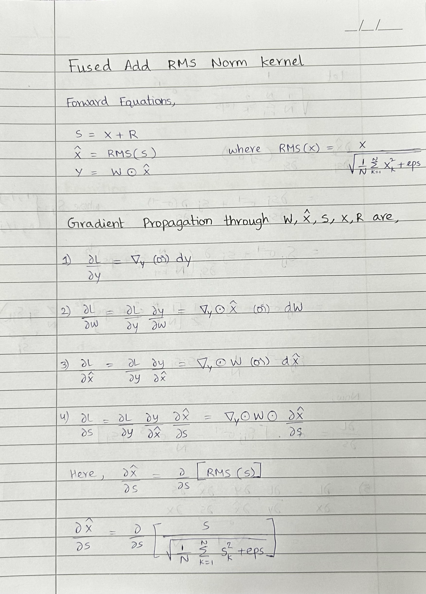 | 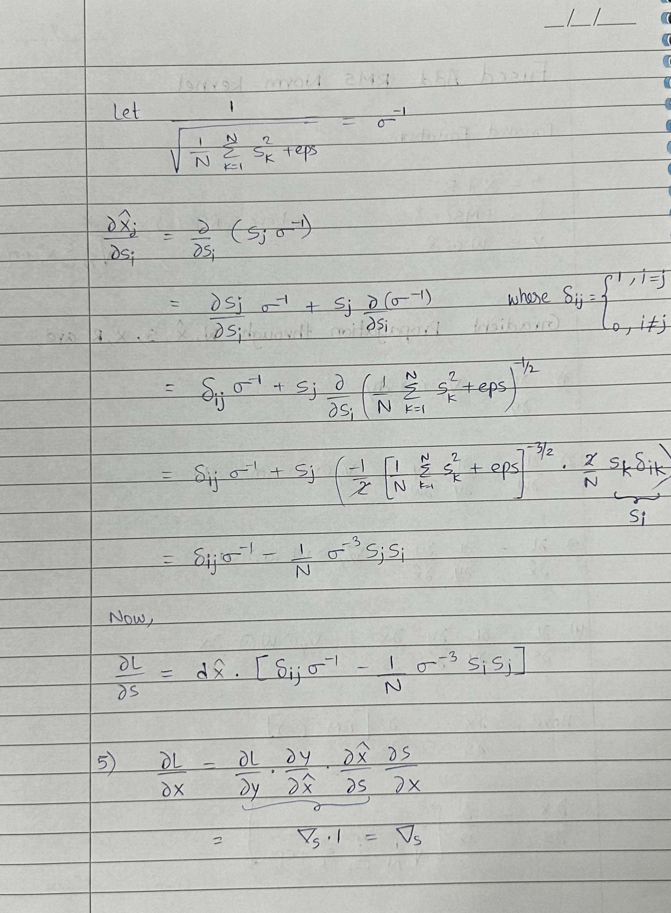 | 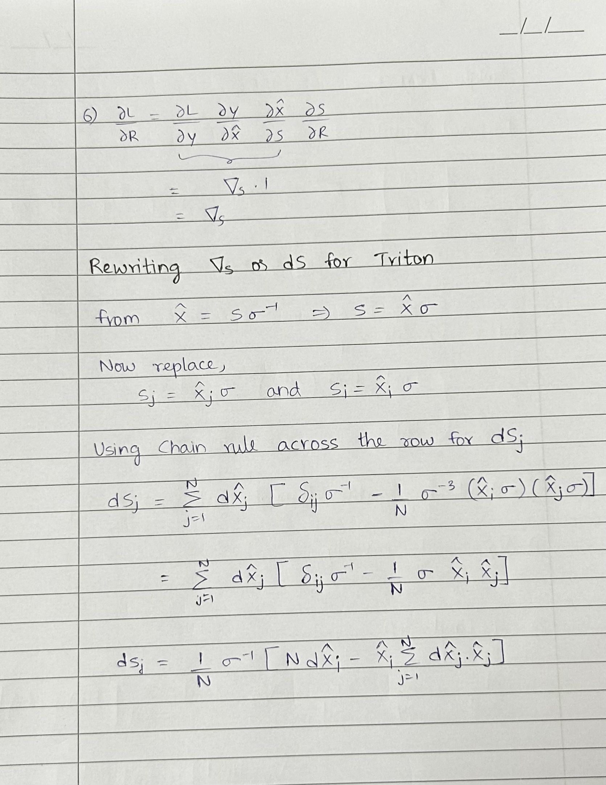 |

---

## 2. SwiGLU with Soft Clamping

- **Implementation**: [`swiglu.py`](./swiglu.py)
- **Handwritten Notes**: [Page 1](../../assets/kernel_derivatives_notes/IMG_6124.png) | [Page 2](../../assets/kernel_derivatives_notes/IMG_6126.png) | [Page 3](../../assets/kernel_derivatives_notes/IMG_6127.png)

### 2.1 Forward Formulation

Given a packed linear MLP projection $X \in \mathbb{R}^{2N}$ sliced into gate and up components:
$$X = \begin{bmatrix} X_{\text{gate}} \\ X_{\text{up}} \end{bmatrix}, \quad X_{\text{gate}} = X_{[0:N]}, \quad X_{\text{up}} = X_{[N:2N]}$$

1. **SiLU Activation on Gate**:
   $$\hat{X} = \text{SiLU}(X_{\text{gate}}) = X_{\text{gate}} \cdot \sigma(X_{\text{gate}})$$
   where $\sigma(z) = \frac{1}{1 + e^{-z}}$ is the standard sigmoid function.

2. **Gated Product**:
   $$\text{out} = \hat{X} \odot X_{\text{up}} = (X_{\text{gate}} \cdot \sigma(X_{\text{gate}})) \odot X_{\text{up}}$$

3. **Soft-Clamping (Logit/Activation Capping)**:
   $$Y = \begin{cases} \text{limit} \cdot \tanh\left(\frac{\text{out}}{\text{limit}}\right) & \text{if } \text{limit} > 0 \\ \text{out} & \text{otherwise} \end{cases}$$

---

### 2.2 Backward Pass Derivation

Let $\nabla_Y = \frac{\partial L}{\partial Y} = dY$.

#### Step 1: Gradient through Soft-Clamping ($\nabla_{\text{out}}$)
If $\text{limit} > 0$:
$$\frac{\partial L}{\partial \text{out}} = \frac{\partial L}{\partial Y} \odot \frac{\partial}{\partial \text{out}}\left[ \text{limit} \cdot \tanh\left(\frac{\text{out}}{\text{limit}}\right) \right]$$
Using $\frac{d}{du}[\tanh(u)] = 1 - \tanh^2(u)$:
$$\frac{\partial L}{\partial \text{out}} = \nabla_Y \odot \text{limit} \left[ 1 - \tanh^2\left(\frac{\text{out}}{\text{limit}}\right) \right] \cdot \frac{1}{\text{limit}} = \nabla_Y \odot \left[ 1 - \tanh^2\left(\frac{\text{out}}{\text{limit}}\right) \right]$$

If $\text{limit} \le 0$:
$$\nabla_{\text{out}} = \nabla_Y$$

Letting $t = \tanh(\text{out} / \text{limit})$ (cached during forward pass):
$$\boxed{\nabla_{\text{out}} = \nabla_Y \odot (1 - t^2)}$$

#### Step 2: Gradient w.r.t. Up-Projection ($X_{\text{up}}$)
$$\boxed{\nabla_{X_{\text{up}}} = \frac{\partial L}{\partial X_{\text{up}}} = \nabla_{\text{out}} \odot \hat{X} = \nabla_{\text{out}} \odot \text{SiLU}(X_{\text{gate}})}$$

#### Step 3: Gradient w.r.t. Activated Gate ($\hat{X}$)
$$\nabla_{\hat{X}} = \frac{\partial L}{\partial \hat{X}} = \nabla_{\text{out}} \odot X_{\text{up}}$$

#### Step 4: Gradient w.r.t. Gate Input ($X_{\text{gate}}$)
$$\frac{\partial L}{\partial X_{\text{gate}}} = \nabla_{\hat{X}} \odot \frac{\partial}{\partial X_{\text{gate}}}\left[ X_{\text{gate}} \cdot \sigma(X_{\text{gate}}) \right]$$
Applying product rule:
$$\frac{\partial}{\partial X_{\text{gate}}}\left[ X_{\text{gate}} \sigma(X_{\text{gate}}) \right] = 1 \cdot \sigma(X_{\text{gate}}) + X_{\text{gate}} \frac{\partial \sigma(X_{\text{gate}})}{\partial X_{\text{gate}}}$$
Since $\frac{d}{dz}[\sigma(z)] = \sigma(z)(1 - \sigma(z))$:
$$\frac{\partial}{\partial X_{\text{gate}}}\left[ X_{\text{gate}} \sigma(X_{\text{gate}}) \right] = \sigma(X_{\text{gate}}) + X_{\text{gate}} \sigma(X_{\text{gate}})(1 - \sigma(X_{\text{gate}})) = \sigma(X_{\text{gate}}) \cdot \left[ 1 + X_{\text{gate}}(1 - \sigma(X_{\text{gate}})) \right]$$

Therefore:
$$\boxed{\nabla_{X_{\text{gate}}} = \nabla_{\text{out}} \odot X_{\text{up}} \odot \sigma(X_{\text{gate}}) \cdot \left[ 1 + X_{\text{gate}}(1 - \sigma(X_{\text{gate}})) \right]}$$

#### Step 5: Full Gradient Assembly
Concatenate directly into the contiguous gradient output buffer $\nabla_X \in \mathbb{R}^{2N}$:
$$\boxed{\nabla_X = \begin{bmatrix} \nabla_{X_{\text{gate}}} \\ \nabla_{X_{\text{up}}} \end{bmatrix}}$$

---

### 2.3 Triton Implementation Mapping

In `_swiglu_bwd_kernel` ([`swiglu.py`](./swiglu.py#L93-L139)):
```python
if limit > 0:
    t = tl.load(TANH_ptr + col_offs, mask=mask, other=0.0).to(tl.float32)
    dout = dy * (1.0 - t * t)
else:
    dout = dy

sig_g = tl.sigmoid(x_gate)
silu_g = x_gate * sig_g

dx_up = dout * silu_g
dx_gate = dout * x_up * sig_g * (1.0 + x_gate * (1.0 - sig_g))

tl.store(dX_ptr + col_offs, dx_gate.to(dX_ptr.dtype.element_ty), mask=mask)
tl.store(dX_ptr + N + col_offs, dx_up.to(dX_ptr.dtype.element_ty), mask=mask)
```

---

### 2.4 Handwritten Notes Reference

| Note 1: Forward & Tanh Clamping | Note 2: SiLU Derivative Chain | Note 3: Gradient Concatenation |
| :---: | :---: | :---: |
| 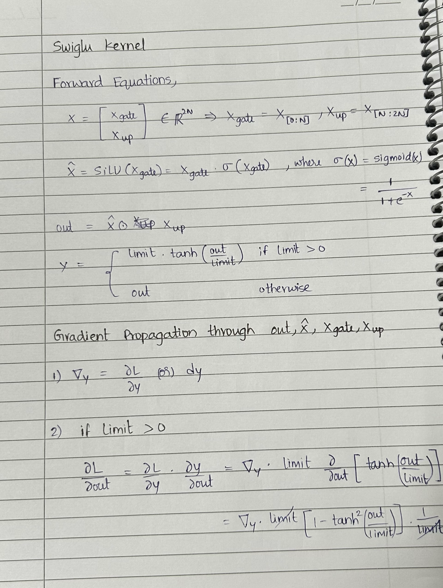 | 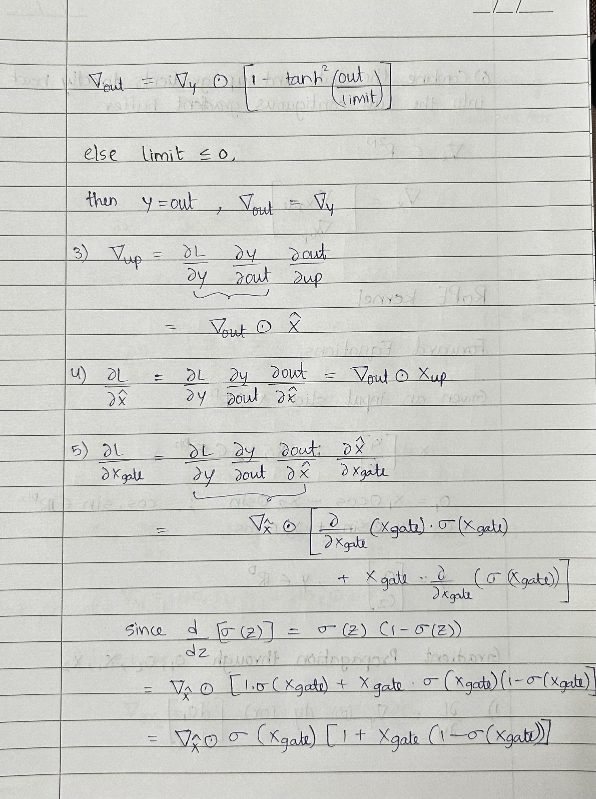 | 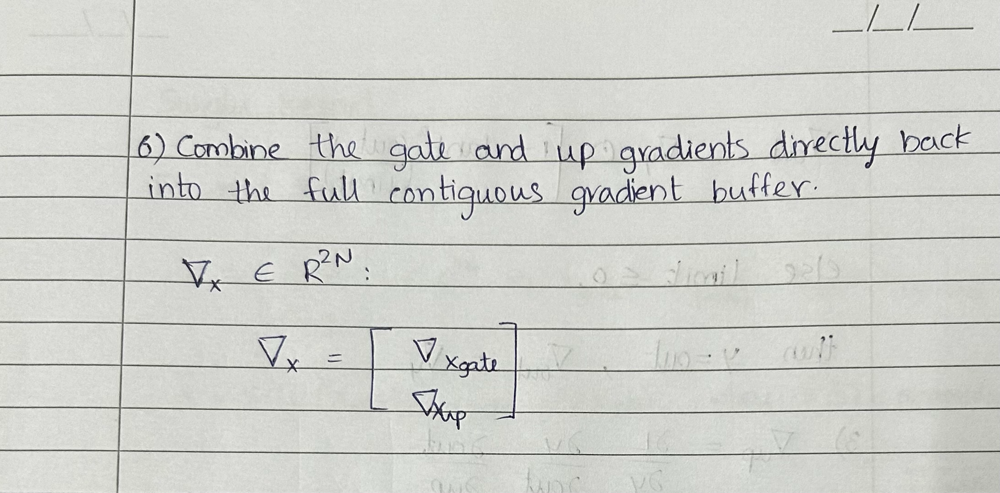 |

---

## 3. Rotary Position Embedding (RoPE)

- **Implementation**: [`apply_rope.py`](./apply_rope.py)
- **Handwritten Notes**: [Page 1](../../assets/kernel_derivatives_notes/IMG_6128.png) | [Page 2](../../assets/kernel_derivatives_notes/IMG_6129.png) | [Page 3](../../assets/kernel_derivatives_notes/IMG_6130.png)

### 3.1 Forward Formulation

Given a feature slice $X \in \mathbb{R}^D$ divided into halves $X_1, X_2 \in \mathbb{R}^{D/2}$, and precomputed frequency tables $\cos, \sin \in \mathbb{R}^{D/2}$:

$$X = \begin{bmatrix} X_1 \\ X_2 \end{bmatrix}$$

1. **2D Orthogonal Rotation**:
   $$O_1 = X_1 \odot \cos - X_2 \odot \sin$$
   $$O_2 = X_1 \odot \sin + X_2 \odot \cos$$

2. **Output Embedding**:
   $$Y = \begin{bmatrix} O_1 \\ O_2 \end{bmatrix} \in \mathbb{R}^D$$

---

### 3.2 Backward Pass Derivation

Let the upstream gradient partitioned into halves be:
$$\nabla_Y = dY = \begin{bmatrix} dO_1 \\ dO_2 \end{bmatrix}, \quad dO_1 = \frac{\partial L}{\partial O_1}, \quad dO_2 = \frac{\partial L}{\partial O_2}$$

#### Step 1: Gradient w.r.t. $X_1$
Using total derivative:
$$\frac{\partial L}{\partial X_1} = \frac{\partial L}{\partial O_1} \cdot \frac{\partial O_1}{\partial X_1} + \frac{\partial L}{\partial O_2} \cdot \frac{\partial O_2}{\partial X_1}$$

Because $O_1$ and $O_2$ are element-wise operations on $X_1$:
$$\frac{\partial O_1}{\partial X_1} = \text{diag}(\cos), \quad \frac{\partial O_2}{\partial X_1} = \text{diag}(\sin)$$

Therefore:
$$\boxed{\nabla_{X_1} = dO_1 \odot \cos + dO_2 \odot \sin}$$

#### Step 2: Gradient w.r.t. $X_2$
Similarly:
$$\frac{\partial L}{\partial X_2} = \frac{\partial L}{\partial O_1} \cdot \frac{\partial O_1}{\partial X_2} + \frac{\partial L}{\partial O_2} \cdot \frac{\partial O_2}{\partial X_2}$$

Where:
$$\frac{\partial O_1}{\partial X_2} = \text{diag}(-\sin), \quad \frac{\partial O_2}{\partial X_2} = \text{diag}(\cos)$$

Therefore:
$$\boxed{\nabla_{X_2} = -dO_1 \odot \sin + dO_2 \odot \cos}$$

#### Step 3: Gradient Concatenation
$$\boxed{\nabla_X = \begin{bmatrix} \nabla_{X_1} \\ \nabla_{X_2} \end{bmatrix} = \begin{bmatrix} dO_1 \odot \cos + dO_2 \odot \sin \\ -dO_1 \odot \sin + dO_2 \odot \cos \end{bmatrix}}$$

> **Intuition**: The backward operation corresponds to rotation by $-\theta$, which exactly matches the inverse rotation matrix:
> $$\begin{bmatrix} \cos & \sin \\ -\sin & \cos \end{bmatrix} = \begin{bmatrix} \cos & -\sin \\ \sin & \cos \end{bmatrix}^T = R(\theta)^{-1}$$

---

### 3.3 Triton Implementation Mapping

In `_apply_rope_bwd_kernel` ([`apply_rope.py`](./apply_rope.py#L93-L140)):
```python
cos = tl.load(cos_base + col_offs * stride_cos_d, mask=mask, other=0.0).to(tl.float32)
sin = tl.load(sin_base + col_offs * stride_sin_d, mask=mask, other=0.0).to(tl.float32)

d_o1 = tl.load(dy_base + col_offs * stride_dy_d, mask=mask, other=0.0).to(tl.float32)
d_o2 = tl.load(dy_base + (N + col_offs) * stride_dy_d, mask=mask, other=0.0).to(tl.float32)

d_x1 = d_o1 * cos + d_o2 * sin
d_x2 = -d_o1 * sin + d_o2 * cos

tl.store(dx_base + col_offs * stride_dx_d, d_x1.to(dX_ptr.dtype.element_ty), mask=mask)
tl.store(dx_base + (N + col_offs) * stride_dx_d, d_x2.to(dX_ptr.dtype.element_ty), mask=mask)
```

---

### 3.4 Handwritten Notes Reference

| Note 1: Forward Rotation | Note 2: Jacobian for $X_1$ | Note 3: Jacobian for $X_2$ & Matrix Form |
| :---: | :---: | :---: |
| 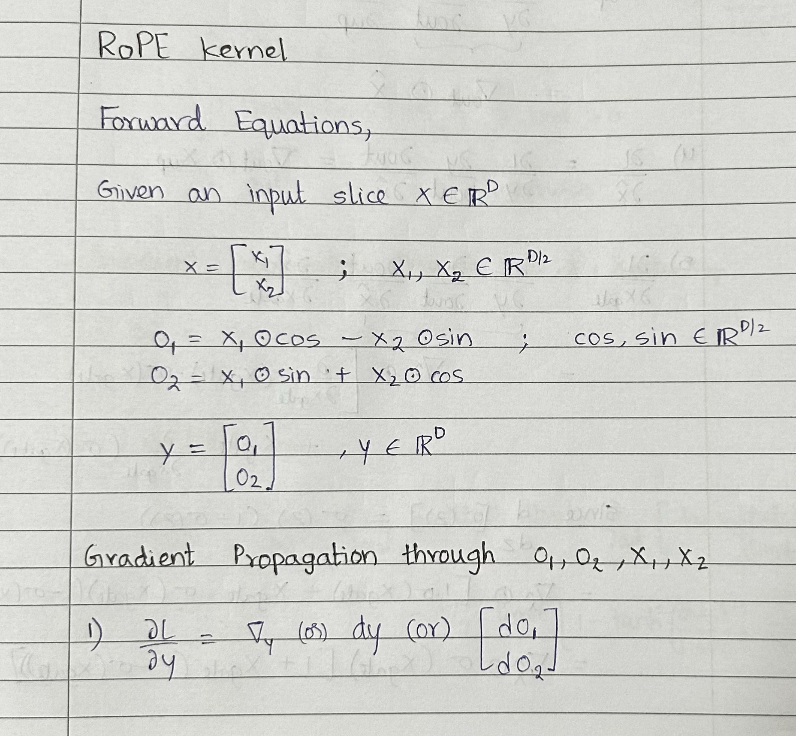 | 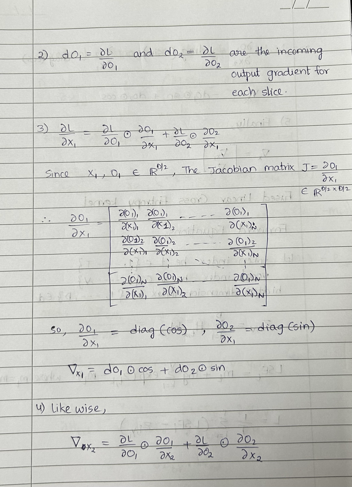 | 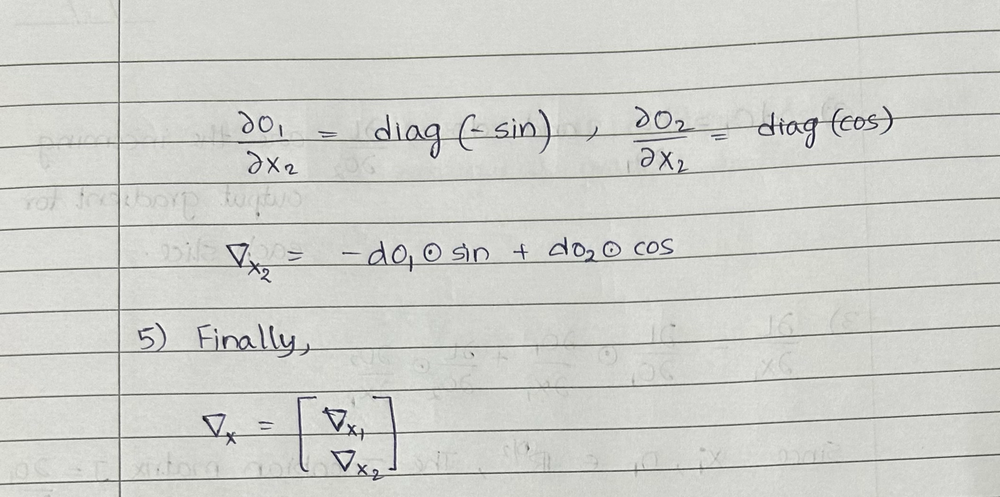 |

---

## 4. Fused Linear Cross Entropy

- **Implementation**: [`fused_linear_cross_entropy.py`](./fused_linear_cross_entropy.py)
- **Handwritten Notes**: [Page 1](../../assets/kernel_derivatives_notes/IMG_6131.png) | [Page 2](../../assets/kernel_derivatives_notes/IMG_6132.png) | [Page 3](../../assets/kernel_derivatives_notes/IMG_6133.png)

### 4.1 Forward Formulation

Let:
- Token sequence index $t \in \{1, \dots, T\}$
- Vocabulary index $v \in \{1, \dots, V\}$
- Hidden dimension index $d \in \{1, \dots, D\}$
- Hidden activations $H \in \mathbb{R}^{T \times D}$
- Language Model head weights $W \in \mathbb{R}^{V \times D}$
- Ground truth target tokens $y \in \{1, \dots, V\}^T$

1. **Logit Projection**:
   $$z_{t, v} = \sum_{d=1}^D H_{t, d} W_{v, d} \quad \iff \quad Z = H W^T$$

2. **Numerically Stable Log-Sum-Exp (LSE)**:
   $$m_t = \max_{k \in \{1, \dots, V\}} z_{t, k}$$
   $$\text{LSE}_t = m_t + \log \sum_{k=1}^V \exp(z_{t, k} - m_t)$$

3. **Cross Entropy Loss with Mean Reduction**:
   $$L = \frac{1}{T}\sum_{t=1}^T (\text{LSE}_t - z_{t, y_t})$$

---

### 4.2 Backward Pass Derivation

#### Step 1: Gradient w.r.t. Logits ($z_{t, v}$)
$$\frac{\partial L}{\partial z_{t, v}} = \frac{1}{T}\sum_{i=1}^T \left( \frac{\partial \text{LSE}_i}{\partial z_{t, v}} - \frac{\partial z_{i, y_i}}{\partial z_{t, v}} \right)$$

Because $\text{LSE}_i$ depends on $z_{t, v}$ only when $i = t$:
$$\frac{\partial \text{LSE}_t}{\partial z_{t, v}} = \frac{\partial}{\partial z_{t, v}}\left( m_t + \log \sum_{k=1}^V \exp(z_{t, k} - m_t) \right)$$
$$= 0 + \frac{1}{\sum_{k=1}^V \exp(z_{t, k} - m_t)} \cdot \frac{\partial}{\partial z_{t, v}}\exp(z_{t, v} - m_t) = \frac{\exp(z_{t, v} - m_t)}{\sum_{k=1}^V \exp(z_{t, k} - m_t)} = P_{t, v}$$
where $P_{t, v} = \text{Softmax}(Z_t)_v$.

And for the target logit:
$$\frac{\partial z_{t, y_t}}{\partial z_{t, v}} = \mathbb{I}(v = y_t)$$

Therefore:
$$\boxed{dz_{t, v} = \frac{\partial L}{\partial z_{t, v}} = \frac{1}{T}(P_{t, v} - \mathbb{I}(v = y_t))}$$

#### Step 2: Gradient w.r.t. Hidden States ($H_{t, d}$)
Applying the multivariable chain rule:
$$\frac{\partial L}{\partial H_{t, d}} = \sum_{v=1}^V \frac{\partial L}{\partial z_{t, v}} \frac{\partial z_{t, v}}{\partial H_{t, d}}$$
Since $z_{t, v} = \sum_{k=1}^D H_{t, k} W_{v, k} \implies \frac{\partial z_{t, v}}{\partial H_{t, d}} = W_{v, d}$:
$$\boxed{\frac{\partial L}{\partial H_{t, d}} = \sum_{v=1}^V dz_{t, v} W_{v, d} \quad \iff \quad dH = dZ \cdot W}$$

#### Step 3: Gradient w.r.t. LM Head Weight ($W_{v, d}$)
$$\frac{\partial L}{\partial W_{v, d}} = \sum_{t=1}^T \frac{\partial L}{\partial z_{t, v}} \frac{\partial z_{t, v}}{\partial W_{v, d}}$$
Since $\frac{\partial z_{t, v}}{\partial W_{v, d}} = H_{t, d}$:
$$\boxed{\frac{\partial L}{\partial W_{v, d}} = \sum_{t=1}^T dz_{t, v} H_{t, d} \quad \iff \quad dW = dZ^T \cdot H}$$

---

### 4.3 Triton Implementation Mapping

In `_cross_entropy_fwd_inplace_kernel` ([`fused_linear_cross_entropy.py`](./fused_linear_cross_entropy.py#L76-L179)):
```python
# Pass 1: Streaming online log-sum-exp
for col_start in range(0, n_cols, BLOCK_V):
    logits = tl.load(row_logits_ptr + cols, mask=mask, other=float("-inf")).to(tl.float32)
    tile_max = tl.max(logits, axis=0)
    new_max = tl.maximum(running_max, tile_max)
    old_scale = tl.exp2((running_max - new_max) * LOG2_E)
    tile_sum = tl.sum(tl.exp2((logits - new_max) * LOG2_E), axis=0)
    running_sum = running_sum * old_scale + tile_sum
    running_max = new_max

lse = running_max + tl.log(running_sum)
target_logit = tl.load(row_logits_ptr + target).to(tl.float32)
tl.store(row_loss_ptr, lse - target_logit)

# Pass 2: In-place gradient computation
if WRITE_GRADIENTS:
    probabilities = tl.exp2((logits - lse) * LOG2_E)
    target_delta = tl.where(cols == target, 1.0, 0.0)
    grad_logits = (probabilities - target_delta) * inv_n
    tl.store(row_logits_ptr + cols, grad_logits, mask=mask)
```

---

### 4.4 Handwritten Notes Reference

| Note 1: Forward & LSE | Note 2: Logit & Hidden State Gradients | Note 3: Weight Gradient Formulation |
| :---: | :---: | :---: |
| 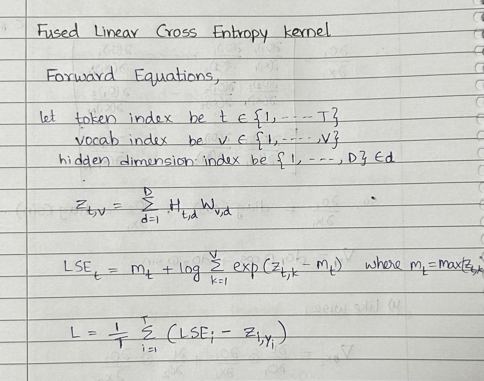 | 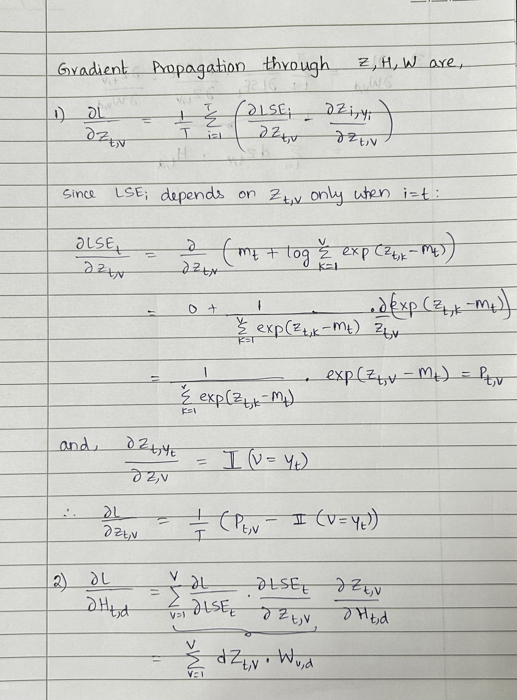 | 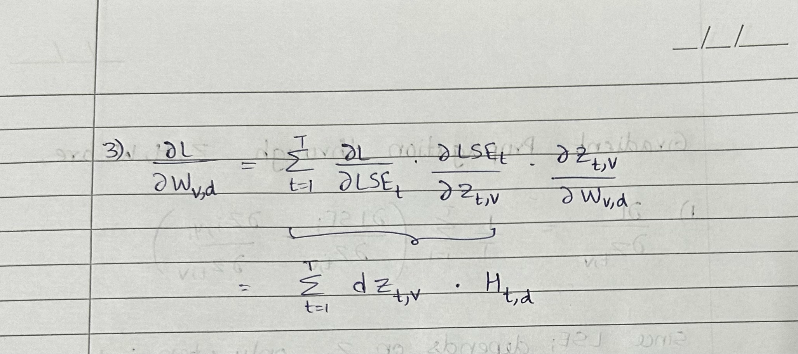 |

---

## Benchmarking & Verification

Every kernel in this directory is paired with complete unit test and benchmark suites verifying numerical equivalence against reference PyTorch eager implementations across `float32`, `float16`, and `bfloat16`.

### Running Verification Tests

```bash
# 1. Fused Add RMSNorm
python src/kernels/fused_add_rms_norm.py

# 2. SwiGLU Activation
python src/kernels/swiglu.py

# 3. Rotary Position Embedding
python src/kernels/apply_rope.py

# 4. Fused Linear Cross Entropy
python src/kernels/fused_linear_cross_entropy.py
```
